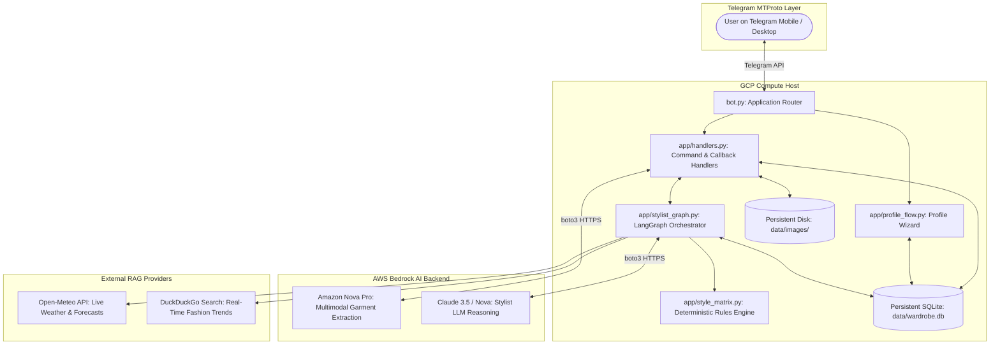
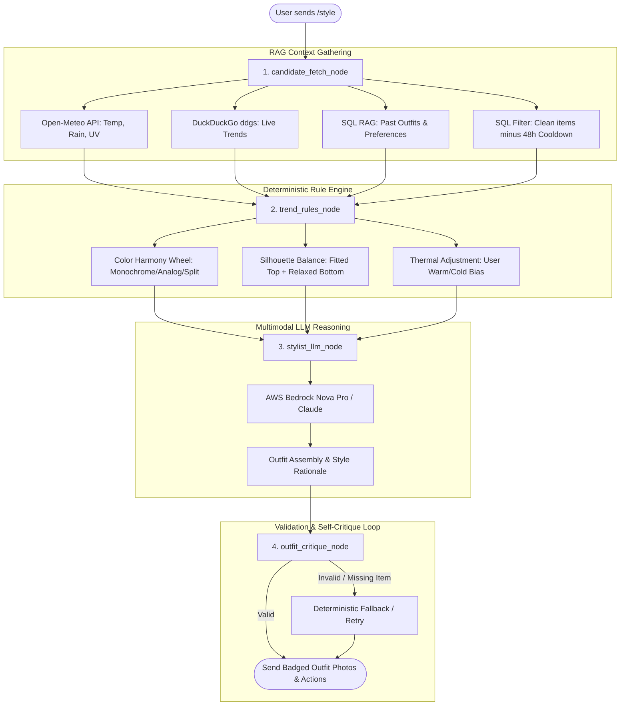

# 👗 AI Stylist & Smart Wardrobe Manager

> **An Agentic AI personal styling assistant delivered over Telegram.**  
> Built with multimodal vision intake, human-in-the-loop refinement, conservative duplicate detection, interactive body profiling, and a stateful **LangGraph** styling engine powered by live weather (Open-Meteo), real-time web trends (DuckDuckGo `ddgs`), outfit history RAG, and deterministic color/proportion matrices.

---

## 🧑‍⚖️ Execution & Judge Evaluation Guide

To evaluate the solution immediately without spending time photographing and uploading 10+ garments, follow the quick setup steps below to clone, configure, load the pre-seeded evaluation database, and evaluate the bot.

---

### 🚀 1. Clone, Environment & Dependencies

```bash
# 1. Clone the repository
git clone https://github.com/Jerrywoohoo/Fashion-sense-bot.git
cd Fashion-sense-bot

# 2. Create and activate a clean Python virtual environment (Python 3.10+ / 3.12 recommended)
python3 -m venv .venv
source .venv/bin/activate       # On Windows: .venv\Scripts\activate

# 3. Install required production dependencies
pip install --upgrade pip
pip install -r requirements.txt
```

---

### 🔑 2. Environment Configuration (`.env`)

Copy `.env.example` to create your active `.env` file:
```bash
cp .env.example .env
```

Ensure your `.env` contains your API credentials:
```env
# Required: Telegram Bot Token from @BotFather
TELEGRAM_BOT_TOKEN=your_bot_token_here

# Required: AWS Bedrock Credentials (Vision & Stylist)
AWS_ACCESS_KEY_ID=your_aws_access_key
AWS_SECRET_ACCESS_KEY=your_aws_secret_key
# Set AWS_SESSION_TOKEN only if using temporary session keys (AWS SSO / Academy):
AWS_SESSION_TOKEN=
AWS_DEFAULT_REGION=us-east-1

# Persistence & Judge Access
DATABASE_PATH=data/wardrobe.db
ADMIN_TEST_PASSWORD=demo123
```

---

### 📦 3. Pre-Seeded Evaluation Database Setup

> [!IMPORTANT]
> **Evaluation Testing Database (`wardrobe.db`)**:  
> We provide our pre-seeded evaluation database separately as a submission file (`wardrobe.db`) pre-populated with diverse garments across all categories.
> 
> If you are setting up with the separately provided database file:
> 1. Download the provided `wardrobe.db` file.
> 2. Move or copy it into the `data/` directory of the project:
>    ```bash
>    mkdir -p data
>    mv /path/to/downloaded/wardrobe.db data/wardrobe.db
>    ```
> *(Note: A pre-seeded `data/wardrobe.db` is also tracked in the repository so the bot can be tested immediately out-of-the-box if you do not replace it.)*

---

### ⚡ 4. Launch the Bot Application

```bash
python bot.py
```
*The bot runs with live terminal logging. You can stop it cleanly anytime with `Ctrl + C`.*

---

### 🎮 5. Zero-Friction Judge Testing on Telegram

1. Open your Telegram client and start your bot by sending **`/start`**.
2. Switch to the evaluation wardrobe by sending:
   ```text
   /admintest
   ```
3. When prompted, enter the evaluation password:
   ```text
   demo123
   ```
4. You are now inside **Shared Judge Pool Mode** (`POOL_TEST_USER`):
   - **`/wardrobe`**: Inspect the digital wardrobe across Tops, Bottoms, Outerwear, Footwear, and Accessories with photo previews and 2-step management.
   - **`/style dinner date in Tokyo`** or **`/style rainy office day in London`**: Triggers the live Open-Meteo weather RAG, DuckDuckGo trend scraper, and LangGraph outfit assembly.
   - **Interactive Actions**: Tap `🧺 Item in Laundry` to test wardrobe rotation exclusions, or `🔄 More Options` for alternative looks.
5. When finished, send **`/adminlive`** to return to your isolated private wardrobe.

---

### 📋 Available Telegram Commands Reference

| Command | Description |
| :--- | :--- |
| **`/admintest`** | **Judge Mode**: Switches to shared test wardrobe pre-seeded with items (Password: `demo123`) |
| **`/style [occasion] [location]`** | Triggers LangGraph styling engine with live weather RAG & web fashion trends |
| **`/wardrobe`** | Interactive 2-step digital wardrobe with badged previews, edit, delete, and laundry controls |
| **`/profile`** | 7-step onboarding wizard (body build, proportions, preferred silhouettes, thermal bias) |
| **`/laundry`** | View dirty laundry hamper and toggle items clean |
| **`/delete`** | Delete individual items or execute a safe 2-step complete wardrobe reset |
| **`/adminlive`** | Exits judge pool mode and returns to your isolated private wardrobe |
| **`/cancel`** | Aborts any active prompt, intake correction, or conversation flow |

---

## 🌟 Methodology & Functional Overview

```
┌─────────────────────────────────────────────────────────────────────────────┐
│                              AGENTIC LIFECYCLE                              │
├──────────────────┬──────────────────┬──────────────────┬────────────────────┤
│ 1. PHOTO INTAKE  │ 2. HITL REVIEW   │ 3. WARDROBE MGT  │ 4. AGENTIC STYLIST │
│ • Single & OOTD  │ • Natural prompt │ • Clean 2-step   │ • Live Weather RAG │
│ • Multi-piece    │ • Granular dup   │ • 4-word badges  │ • DuckDuckGo Trends│
│ • Bedrock Vision │ • Instant verify │ • Natural sort   │ • LangGraph Engine │
└──────────────────┴──────────────────┴──────────────────┴────────────────────┘
```

1. **Multimodal Vision Intake (`app/extractor.py`)**:
   - Classifies uploads into single-item photos or full **Outfit of the Day (OOTD)** images.
   - Extracts structured Pydantic schemas: category, sub-category, primary/accent colors, silhouette fit, fabric weight, formality tier ($1-5$), seasonality, and styling tags.
   - Labels photos in memory with high-contrast, labeled visual badges using Pillow.

2. **Human-in-the-Loop (HITL) & Granular Duplicate Linking (`app/handlers.py`)**:
   - Staged in unverified state (`is_verified = 0`) until user confirms or supplies natural-language revisions (e.g. *"the jacket is oversized charcoal wool"*).
   - **Granular Per-Item Duplicate Selection**: When multiple items in an OOTD resemble existing clothes, users can toggle each item individually (e.g., link shirt to existing item, but keep pants as a brand-new piece).

3. **7-Step Profile Onboarding (`app/profile_flow.py`)**:
   - Captures body build, proportions (e.g., long torso, broad shoulders), preferred silhouettes, and thermal preference (runs warm/cold).

4. **Contextual Agentic Stylist Graph (`app/stylist_graph.py`)**:
   - Multi-source RAG combining **live Open-Meteo weather**, **DuckDuckGo fashion trends (`ddgs`)**, **past outfit history**, and **48-hour anti-repeat rotation cooldown**.
   - Enforces deterministic color harmony (monochromatic, complementary, analogous) and silhouette balance from `app/style_matrix.py`.

5. **2-Step Wardrobe & Laundry Management (`/wardrobe`, `/laundry`)**:
   - Clean 2-step category navigation with badged photo albums and in-place Edit, Delete, and Laundry actions.
   - 4-word badge display cap prevents chat UI overflow while SQLite retains unconstrained full descriptions for LLM reasoning.
   - Natural numeric sorting (`item_101`, `item_102`...) across all preview cards and buttons.

---

## 🏗️ Technical Architecture & LangGraph State Machine

The solution decouples stateful bot routing and storage (**Google Cloud Platform Compute Engine**) from generative AI compute (**AWS Bedrock**):



### LangGraph Stylist Node State Machine



---

## 📂 Project Directory & File Purpose Map

| File / Module | Layer | Purpose |
| :--- | :--- | :--- |
| [`bot.py`](file:///Volumes/Jerry_SSD%201/Work/AI-work/Fashion-sense/bot.py) | Entrypoint | Builds Telegram Application, registers command/callback handlers, runs polling |
| [`app/config.py`](file:///Volumes/Jerry_SSD%201/Work/AI-work/Fashion-sense/app/config.py) | Config | Loads `.env` credentials, parses `Settings` dataclass, validates API keys |
| [`app/database.py`](file:///Volumes/Jerry_SSD%201/Work/AI-work/Fashion-sense/app/database.py) | Persistence | SQLite connection wrapper, schema migrations, and CRUD helper queries |
| [`app/extractor.py`](file:///Volumes/Jerry_SSD%201/Work/AI-work/Fashion-sense/app/extractor.py) | Vision / AI | AWS Bedrock vision extraction, 64-bit pHash comparison, and photo badge labeling |
| [`app/handlers.py`](file:///Volumes/Jerry_SSD%201/Work/AI-work/Fashion-sense/app/handlers.py) | Controller | Telegram commands (`/wardrobe`, `/style`, `/laundry`), intake debouncing, callbacks |
| [`app/models.py`](file:///Volumes/Jerry_SSD%201/Work/AI-work/Fashion-sense/app/models.py) | Contracts | Pydantic v2 schemas (`ExtractedGarment`, `UserProfile`, `OutfitRecommendation`) |
| [`app/paths.py`](file:///Volumes/Jerry_SSD%201/Work/AI-work/Fashion-sense/app/paths.py) | Filesystem | Path resolver for database, persistent storage, and image assets |
| [`app/profile_flow.py`](file:///Volumes/Jerry_SSD%201/Work/AI-work/Fashion-sense/app/profile_flow.py) | Wizard | 7-step interactive `/profile` ConversationHandler |
| [`app/style_matrix.py`](file:///Volumes/Jerry_SSD%201/Work/AI-work/Fashion-sense/app/style_matrix.py) | Rule Engine | Deterministic color theory, proportion matrix, and offline fallback stylist |
| [`app/stylist_graph.py`](file:///Volumes/Jerry_SSD%201/Work/AI-work/Fashion-sense/app/stylist_graph.py) | Agent Core | LangGraph state machine executing RAG context $\rightarrow$ LLM stylist $\rightarrow$ critique loop |
| [`app/weather.py`](file:///Volumes/Jerry_SSD%201/Work/AI-work/Fashion-sense/app/weather.py) | RAG Tool | Open-Meteo REST client for real-time temperature, precipitation, and UV data |
| [`app/web_search.py`](file:///Volumes/Jerry_SSD%201/Work/AI-work/Fashion-sense/app/web_search.py) | RAG Tool | DuckDuckGo (`ddgs`) trend retriever for occasion-specific fashion context |
| [`data/wardrobe.db`](file:///Volumes/Jerry_SSD%201/Work/AI-work/Fashion-sense/data/wardrobe.db) | Data | SQLite database containing pre-seeded demo wardrobe items for judge testing |

---

## 🧪 Automated Test Suite

The test suite covers database persistence, foreign key constraints, vision extraction schemas, duplicate detection, natural sorting, and callback interactions:

```bash
# Run all unit tests:
python -m unittest discover -s . -p "test_*.py"
```

- **`test_admin_pool.py`**: Verifies admin test pool isolation, markdown escaping, and wardrobe keyboards.
- **`test_batch_and_wardrobe.py`**: Verifies multi-photo batch intake debouncing, 4-word title display caps, foreign key satisfaction, and category filtering.
- **`test_duplicate_detection.py`**: Verifies 64-bit pHash calculations, hue similarity filters, and dual-condition linking.
- **`test_intake_flow.py`**: Verifies HITL verification flow, single-item edits, and wardrobe navigation.
