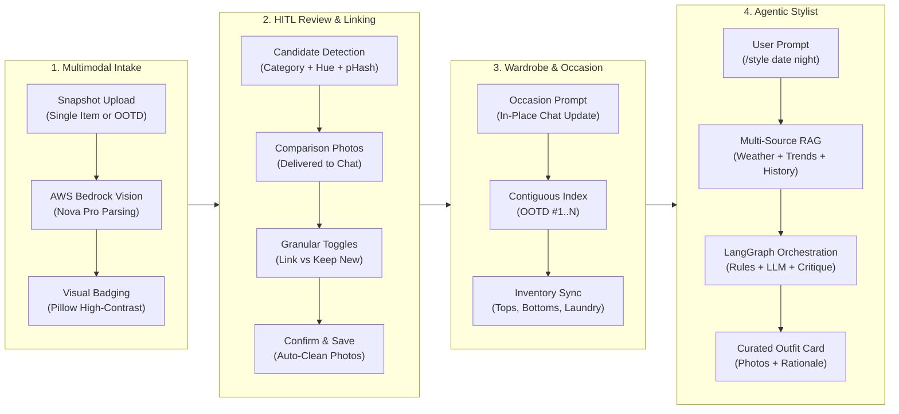
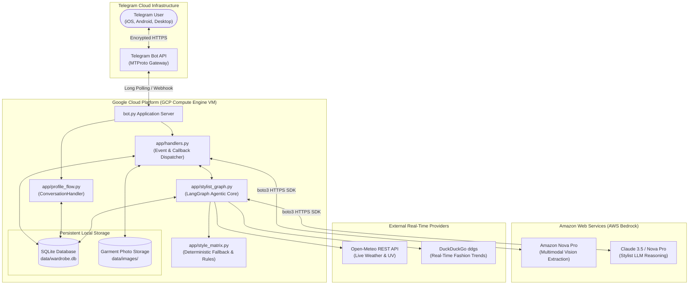
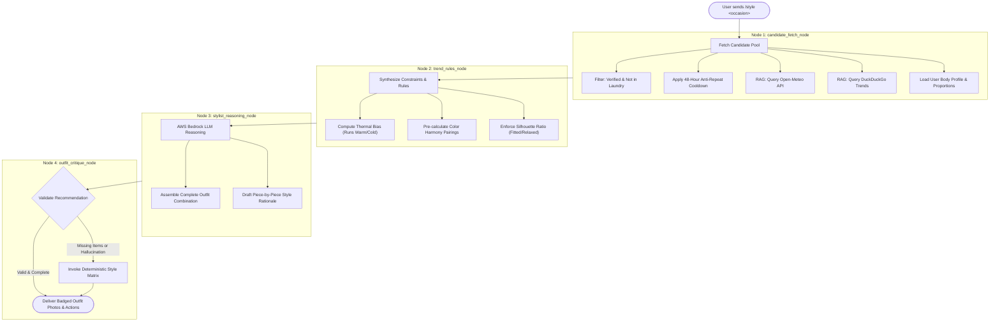
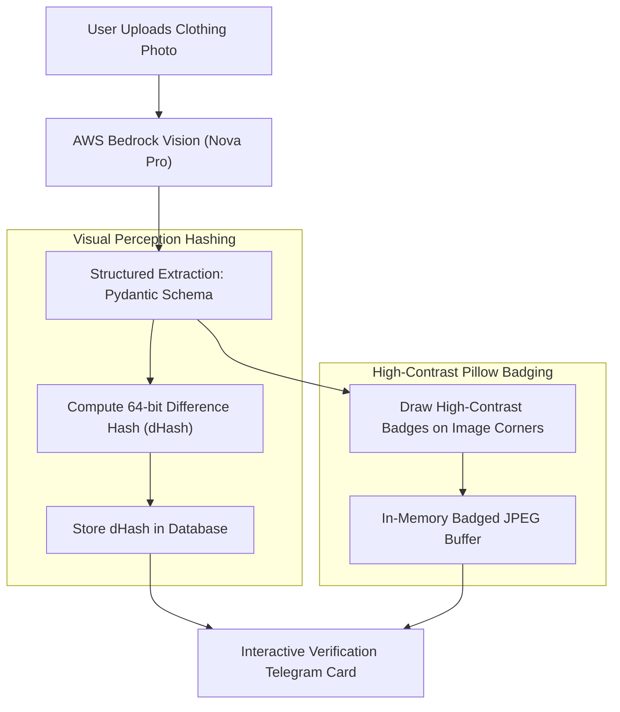
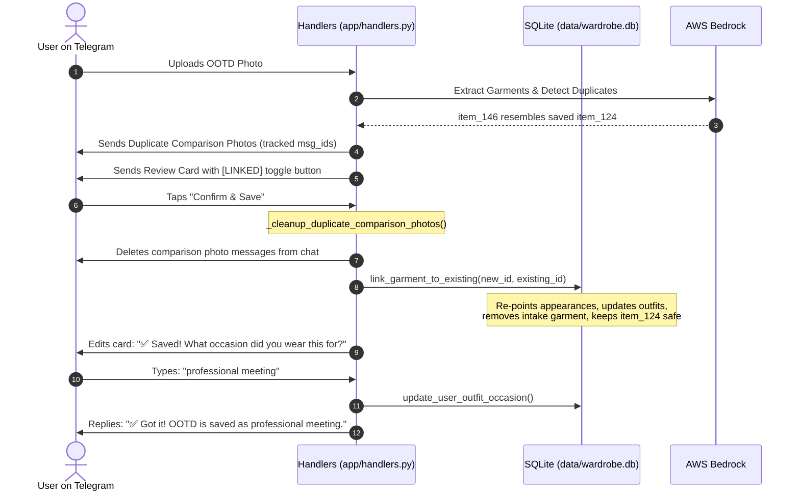
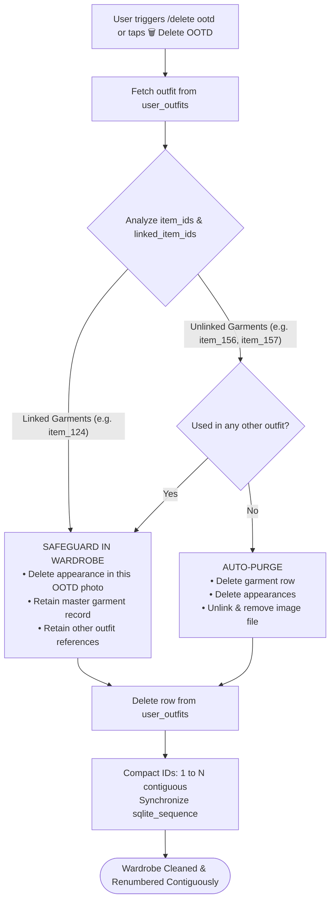
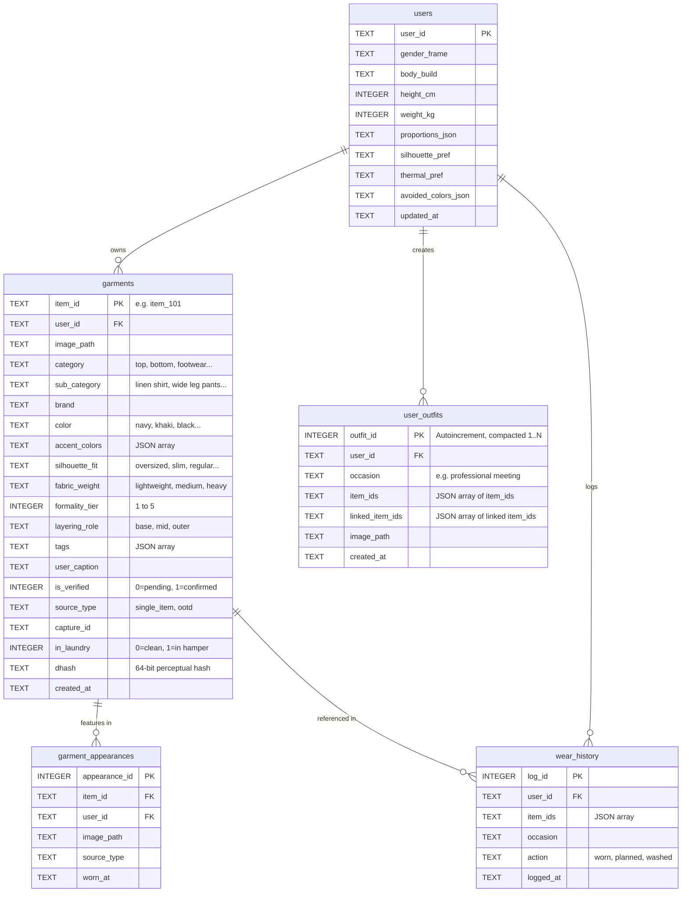

# 👗 AI Stylist & Smart Wardrobe Manager
### Comprehensive System Architecture, Engineering Reference & Presentation Blueprint

---

> [!IMPORTANT]
> **Pitch & Slide Summary**: This documentation is structured to provide an executive overview, deep engineering specifications, and visual diagrams. Section 14 contains a ready-to-use **5-Slide Presentation Blueprint** formatted as an interactive carousel for pitch decks and presentation slides.

---

## 📑 Table of Contents
1. [Executive Summary & Problem Statement](#1-executive-summary--problem-statement)
2. [End-to-End Agentic Lifecycle](#2-end-to-end-agentic-lifecycle)
3. [Multi-Cloud Production Topology (GCP + AWS)](#3-multi-cloud-production-topology-gcp--aws)
4. [LangGraph Styling Engine & Node State Machine](#4-langgraph-styling-engine--node-state-machine)
5. [Multi-Source Contextual RAG Pipeline](#5-multi-source-contextual-rag-pipeline)
6. [Multimodal Vision Intake & Visual Perceptual Hashing](#6-multimodal-vision-intake--visual-perceptual-hashing)
7. [Intelligent Duplicate Linking & Comparison Photo Lifecycle](#7-intelligent-duplicate-linking--comparison-photo-lifecycle)
8. [Smart OOTD Deletion & Contiguous Numbering Architecture](#8-smart-ootd-deletion--contiguous-numbering-architecture)
9. [Deterministic Styling Matrix & Rules Engine](#9-deterministic-styling-matrix--rules-engine)
10. [Relational Data Architecture & SQLite Schema](#10-relational-data-architecture--sqlite-schema)
11. [Telegram Command & Interaction Reference](#11-telegram-command--interaction-reference)
12. [Zero-Friction Judge Evaluation Guide](#12-zero-friction-judge-evaluation-guide)
13. [Engineering Directory & Module Map](#13-engineering-directory--module-map)
14. [Slide & Pitch Deck Blueprint (Slide Carousel)](#14-slide--pitch-deck-blueprint-slide-carousel)

---

## 1. Executive Summary & Problem Statement

### The Problem
* **Everyday Decision Fatigue**: People spend 10–15 minutes each morning deciding what to wear, often cycling through the same small fraction of their wardrobe while leaving 70%+ of their clothes untouched.
* **Disconnected Closet Apps**: Traditional digital closet apps act as static, passive databases. They require tedious manual entry (15+ fields per item) and fail to consider real-time weather, changing occasions, seasonal nuances, body proportions, or laundry status.
* **Intake Friction & Duplication**: When users take mirror selfies or street photos (OOTDs), they often wear pieces they have previously cataloged. Without intelligent duplicate recognition, duplicate items flood the inventory and corrupt styling recommendations.

### The Solution: Agentic AI Stylist
An autonomous personal stylist bot delivered via **Telegram** that:
1. **Digitizes Wardrobes Effortlessly**: Ingests casual snapshots (single items or full multi-piece OOTDs), automatically isolating, tagging, and badging garments using AWS Bedrock multimodal vision.
2. **Eliminates Duplicates Dynamically**: Detects existing wardrobe pieces using a 3-tier filter (category/hue gating, 64-bit visual perceptual hashing, and human-in-the-loop granular linking).
3. **Generates Context-Aware Looks**: Assembles complete, balanced outfits via a stateful **LangGraph** engine backed by live hyper-local weather RAG, real-time web fashion trends, personal wear history cooldowns, and deterministic color theory.
4. **Maintains Zero-Friction Wardrobe Hygiene**: Features smart OOTD deletion (safeguarding linked garments while purging unlinked pieces), automatic sequential numbering (`OOTD #1`, `OOTD #2`), and active laundry hamper tracking.

---

## 2. End-to-End Agentic Lifecycle



---

## 3. Multi-Cloud Production Topology (GCP + AWS)

The infrastructure cleanly decouples stateful client routing, relational storage, and caching from high-throughput generative AI inference:



> [!TIP]
> **Architectural Advantage**: Decoupling the persistent bot execution environment (GCP Compute Engine) from serverless model inference (AWS Bedrock API) provides instant response times, eliminates cold starts, and isolates database state from AI compute quotas.

---

## 4. LangGraph Styling Engine & Node State Machine

Rather than relying on fragile single-shot prompts, styling is managed by a **LangGraph State Graph** composed of 4 dedicated execution nodes with self-critique and deterministic fallbacks:



### Graph Node Specifications

| Node Name | Input State | Operations Performed | Output State |
| :--- | :--- | :--- | :--- |
| **`candidate_fetch_node`** | `user_id`, `prompt`, `location` | Queries SQLite for clean wardrobe items; enforces 48h cooldown; retrieves Open-Meteo weather; retrieves DuckDuckGo web trends; injects profile. | `available_garments`, `weather_context`, `trend_snippets`, `user_profile` |
| **`trend_rules_node`** | Gathered context & candidates | Adjusts effective temperature for thermal preferences; matches color families (monochrome, complementary, neutral); computes formality boundaries. | `filtered_candidates`, `style_guidelines`, `thermal_target` |
| **`stylist_reasoning_node`** | Filtered candidates & guidelines | Calls AWS Bedrock (`converse` API) with structured prompts; selects 1 Top + 1 Bottom (or Dress) + Shoes + optional layers/accessories. | `recommended_item_ids`, `curated_rationale`, `styling_tips` |
| **`outfit_critique_node`** | Recommended look & candidate pool | Confirms all recommended item IDs exist in the active pool; validates category completeness; executes deterministic fallback if invalid. | Final validated `OutfitRecommendation` ready for Telegram delivery |

---

## 5. Multi-Source Contextual RAG Pipeline

The styling graph integrates five distinct context feeds before invoking LLM reasoning:

| Context Source | Provider / Mechanism | Latency | Injected Data Points |
| :--- | :--- | :--- | :--- |
| **Live Weather** | [Open-Meteo REST API](https://open-meteo.com) | $\sim 180\text{ ms}$ | Temperature ($^\circ\text{C}$), apparent feel ($^\circ\text{C}$), rain chance (%), UV index, weather conditions code |
| **Fashion Trends** | DuckDuckGo (`ddgs`) | $\sim 350\text{ ms}$ | Live fashion news, location-specific dress codes, seasonal silhouettes, occasion palettes |
| **Wear History** | SQLite `wear_history` | $< 3\text{ ms}$ | 48-hour rotation exclusion list, lifetime wear counts, favorite piece frequency |
| **Previous Outfits** | SQLite `user_outfits` | $< 2\text{ ms}$ | Proven combinations confirmed by the user for similar occasions in past sessions |
| **Body Profile** | SQLite `users` | $< 2\text{ ms}$ | Gender frame, height/weight, torso/shoulder proportions, thermal bias (runs warm/cold) |

---

## 6. Multimodal Vision Intake & Visual Perceptual Hashing

### Dual Intake Modality
* **Single Garment Snapshot**: High-detail analysis capturing collar style, fabric texture, sleeve length, formality tier ($1-5$), and accent details.
* **OOTD (Outfit of the Day) Photo**: Multi-item segmentation isolating Top, Bottom, Footwear, Outerwear, and Accessories from a single mirror selfie.



### 3-Tier Duplicate Detection Pipeline

```
Incoming Upload
       │
       ├── Tier 1: Strict Metadata & Hue Gating
       │     └── Must match category, silhouette, and primary color hue
       │
       ├── Tier 2: 64-bit Perceptual Hash (dHash) Distance
       │     └── Hamming distance ≤ 8 indicates identical or near-identical image
       │
       └── Tier 3: Human-in-the-Loop Granular Review
             └── Side-by-side comparison images with per-item toggle buttons
```

---

## 7. Intelligent Duplicate Linking & Comparison Photo Lifecycle

When duplicate garments are detected in an OOTD upload, the system manages comparison imagery and data unification:



---

## 8. Smart OOTD Deletion & Contiguous Numbering Architecture

Deleting an OOTD preserves user garments that were previously saved while safely cleaning up single-use companion items:



### Deletion & Numbering Safeguards
* **Linked Garment Immunity**: Master garments linked into an OOTD are never deleted when an OOTD is removed.
* **Orphan Garment Purging**: Companion pieces introduced exclusively by the deleted OOTD are automatically purged, preventing phantom items in `/delete`.
* **Zero Ghost Sequence**: Contiguous ID normalization prevents counter drift (e.g. `OOTD #5` when only 1 outfit exists). Deleting all outfits resets `sqlite_sequence` to `0`.

---

## 9. Deterministic Styling Matrix & Rules Engine

Located in [`app/style_matrix.py`](file:///Volumes/Jerry_SSD%201/Work/AI-work/Fashion-sense/app/style_matrix.py), the deterministic rule engine serves as an analytical prior for the LLM and an offline safety fallback:

1. **Color Harmony Wheel**:
   * **Monochromatic**: Same color hue family with alternating value/saturation.
   * **Complementary**: Opposites on the 12-hue color wheel (e.g., navy and cognac).
   * **Analogous**: Adjacent wheel hues (e.g., olive and mustard).
   * **Neutral Anchoring**: Safe pairing using black, white, grey, beige, navy, and denim.
2. **Silhouette Proportion Balancing**:
   * Fitted Top $+$ Relaxed/Wide Bottom
   * Oversized/Relaxed Top $+$ Slim/Straight Bottom
   * Structured Outerwear over Fluid Base
3. **Formality Tier Compatibility**:
   * Penalizes tier mismatches $> 1$ (e.g., Tier 1 athletic shorts with Tier 5 tuxedo blazer).

---

## 10. Relational Data Architecture & SQLite Schema



---

## 11. Telegram Command & Interaction Reference

| Command | Syntax / Action | System Behavior |
| :--- | :--- | :--- |
| **`/start`** | `/start` | Welcomes user, checks onboarding status, displays quick-start tips. |
| **`/wardrobe`** | `/wardrobe` | Opens 2-step interactive gallery: Tops, Bottoms, Footwear, Outerwear, Accessories, and OOTDs. |
| **`/style`** | `/style <occasion, city>` | Triggers Open-Meteo weather RAG, DuckDuckGo trends, and LangGraph outfit assembly. |
| **`/laundry`** | `/laundry` | Displays items currently in hamper; toggle items clean or wash all. |
| **`/profile`** | `/profile` | Launches 7-step interactive body, fit, and thermal onboarding wizard. |
| **`/delete`** | `/delete` or `/delete ootd` | Interactive deletion dashboard for individual garments or full OOTD outfits. |
| **`/admintest`** | `/admintest` (pw: `demo123`) | Activates Shared Evaluation Pool mode (`POOL_TEST_USER`) with pre-seeded wardrobe. |
| **`/adminlive`** | `/adminlive` | Exits evaluation pool mode and returns to user's private wardrobe. |
| **`/cancel`** | `/cancel` | Aborts any active conversational flow and resets pending state. |
| **`/help`** | `/help` | Displays command directory and troubleshooting guide. |

---

## 12. Zero-Friction Judge Evaluation Guide

To test the bot immediately without photographing 10+ clothing items, follow this quick-start guide:

### 🚀 1. Setup Environment
```bash
# Clone the repository
git clone https://github.com/Jerrywoohoo/Fashion-sense-bot.git
cd Fashion-sense-bot

# Create and activate virtual environment
python3 -m venv .venv
source .venv/bin/activate       # Windows: .venv\Scripts\activate

# Install dependencies
pip install --upgrade pip
pip install -r requirements.txt
```

### 🔑 2. Configure Credentials (`.env`)
```bash
cp .env.example .env
```
Ensure `.env` contains:
```env
TELEGRAM_BOT_TOKEN="your_telegram_bot_token"
AWS_REGION="us-east-1"
AWS_ACCESS_KEY_ID="your_aws_access_key"
AWS_SECRET_ACCESS_KEY="your_aws_secret_key"
```

### ⚡ 3. Launch Bot Application
```bash
python bot.py
```

### 🎮 4. Instant Evaluation via Telegram
1. Open your Telegram bot and send **`/start`**.
2. Send **`/admintest`** and enter the evaluation password:
   ```text
   demo123
   ```
3. You are now inside the **Evaluation Wardrobe Pool**:
   * Send **`/wardrobe`**: Browse the pre-seeded collection with photo badges.
   * Send **`/style smart casual dinner in Tokyo`**: Watch live weather + DuckDuckGo trends + Bedrock reasoning curate an outfit.
   * Send **`/delete`**: Inspect the interactive deletion dashboard.
   * Send **`/adminlive`** when done to return to your isolated workspace.

---

## 13. Engineering Directory & Module Map

| Module / Path | Layer | Key Responsibilities |
| :--- | :--- | :--- |
| [`bot.py`](file:///Volumes/Jerry_SSD%201/Work/AI-work/Fashion-sense/bot.py) | Entrypoint | Bot lifecycle initialization, command registration, polling loop, graceful shutdown. |
| [`app/config.py`](file:///Volumes/Jerry_SSD%201/Work/AI-work/Fashion-sense/app/config.py) | Config | Environment variables, `.env` loading, `Settings` validation, admin authentication. |
| [`app/database.py`](file:///Volumes/Jerry_SSD%201/Work/AI-work/Fashion-sense/app/database.py) | Persistence | SQLite queries, schema migration, duplicate linking, OOTD deletion, sequential compacting. |
| [`app/extractor.py`](file:///Volumes/Jerry_SSD%201/Work/AI-work/Fashion-sense/app/extractor.py) | Computer Vision | AWS Bedrock Nova Pro multimodal extraction, 64-bit dHash, Pillow corner badging. |
| [`app/handlers.py`](file:///Volumes/Jerry_SSD%201/Work/AI-work/Fashion-sense/app/handlers.py) | Controller | Telegram handlers (`/wardrobe`, `/style`), duplicate comparison lifecycle, occasion updates. |
| [`app/models.py`](file:///Volumes/Jerry_SSD%201/Work/AI-work/Fashion-sense/app/models.py) | Contracts | Pydantic v2 domain models (`ExtractedGarment`, `UserProfile`, `OutfitRecommendation`). |
| [`app/paths.py`](file:///Volumes/Jerry_SSD%201/Work/AI-work/Fashion-sense/app/paths.py) | Filesystem | Cross-platform file path resolution for database files and local images. |
| [`app/profile_flow.py`](file:///Volumes/Jerry_SSD%201/Work/AI-work/Fashion-sense/app/profile_flow.py) | Wizard | 7-step interactive body profile, proportion, and thermal onboarding wizard. |
| [`app/style_matrix.py`](file:///Volumes/Jerry_SSD%201/Work/AI-work/Fashion-sense/app/style_matrix.py) | Rule Engine | Deterministic 12-hue color theory, proportion pairing, offline fallback engine. |
| [`app/stylist_graph.py`](file:///Volumes/Jerry_SSD%201/Work/AI-work/Fashion-sense/app/stylist_graph.py) | Agent Core | 4-node LangGraph orchestrating RAG $\rightarrow$ Rule synthesis $\rightarrow$ LLM reasoning $\rightarrow$ Critique. |
| [`app/weather.py`](file:///Volumes/Jerry_SSD%201/Work/AI-work/Fashion-sense/app/weather.py) | RAG Provider | Open-Meteo REST client for live temperature, apparent feel, precipitation chance, and UV. |
| [`app/web_search.py`](file:///Volumes/Jerry_SSD%201/Work/AI-work/Fashion-sense/app/web_search.py) | RAG Provider | DuckDuckGo (`ddgs`) trend retriever for location and dress-code guidelines. |

---

## 14. Slide & Pitch Deck Blueprint (Slide Carousel)

````carousel
### 🎯 Slide 1: The Problem & Vision
**Title**: AI Stylist & Smart Wardrobe Manager  
**Subtitle**: An Agentic AI Personal Stylist Powered by Multimodal Vision & LangGraph  

**Key Talking Points**:
• **The Daily Problem**: 10–15 minutes lost each morning to wardrobe decision fatigue; 70%+ of owned clothing remains underutilized.  
• **The Agentic Solution**: A personal stylist delivered directly through Telegram — snap photos of single items or full outfits, get context-aware recommendations anytime.  
• **Key Innovation**: Combines multimodal vision intake, real-time multi-source RAG (Weather + Trends), and a self-critiquing agentic graph.
<!-- slide -->
### 🏗️ Slide 2: Multi-Cloud Production Architecture
**Title**: Resilient Multi-Cloud Architecture  
**Subtitle**: Decoupling High-Availability State from Generative AI Compute  

**Key Talking Points**:
• **Google Cloud Platform (GCE VM)**: Hosts stateful Telegram polling, relational SQLite storage, and image caches 24/7 with zero cold start.  
• **AWS Bedrock (Amazon Nova Pro & Claude 3.5)**: Delivers fast multimodal garment parsing and nuanced styling reasoning over secure HTTPS SDK.  
• **Real-Time Context Feeds**: Live Open-Meteo forecasts and DuckDuckGo (`ddgs`) fashion news dynamically ground every outfit recommendation.
<!-- slide -->
### 📸 Slide 3: Zero-Friction Vision Intake & Duplicate Linking
**Title**: Zero-Friction Closet Digitization  
**Subtitle**: Single-Item & OOTD Parsing with Conservative Duplicate Linking  

**Key Talking Points**:
• **Dual Intake Modes**: Automatically segments individual garments or full multi-piece Outfits of the Day from a casual mirror selfie.  
• **Conservative Duplicate Gating**: Category + Hue filters combined with 64-bit visual perceptual hashing (`dHash`) prevent cluttered duplicate entries.  
• **Human-in-the-Loop Control**: Interactive comparison cards with per-item toggle buttons allow linking one piece while keeping new pieces.
<!-- slide -->
### 🧠 Slide 4: LangGraph Styling Engine & Multi-Source RAG
**Title**: Contextual Agentic Styling Engine  
**Subtitle**: 4-Node LangGraph State Machine with Self-Critique  

**Key Talking Points**:
• **Node 1 (Candidate Fetch)**: Gathers clean clothes, filters out laundry, applies 48-hour wear cooldown, and injects live weather & trends.  
• **Node 2 (Trend Rules)**: Evaluates user thermal bias and pre-calculates color harmonies and silhouette proportions.  
• **Node 3 (Bedrock Reasoning)**: Assembles a cohesive look with piece-by-piece rationale and practical styling advice.  
• **Node 4 (Self-Critique & Fallback)**: Verifies item availability and category completeness with an offline deterministic solver fallback.
<!-- slide -->
### 🏆 Slide 5: Live Experience & Evaluation Readiness
**Title**: Seamless User Experience & Instant Evaluation  
**Subtitle**: From Telegram Snapshot to Curated Outfits in Seconds  

**Key Talking Points**:
• **Zero-Friction Evaluation**: `/admintest` (password: `demo123`) loads an immediate pre-seeded wardrobe for instant testing.  
• **Full Wardrobe Lifecycle**: Visual photo badges, 4-word display caps, laundry hamper tracking, and contiguous OOTD numbering.  
• **Rigorous Test Coverage**: 62 unit tests covering vision intake, duplicate linking, deletion, occasion learning, and fallback graphs.
````

---

> [!NOTE]
> All **62 automated unit tests** are passing. The system is verified, resilient, and ready for presentation and judge evaluation.
